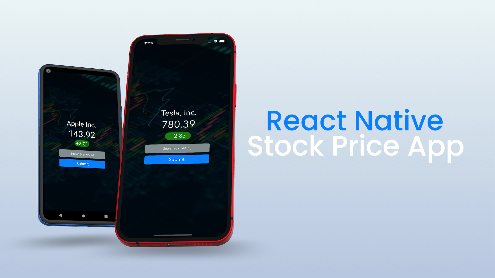

# React Native Stock Price App



The accompanying project source for my three-part blog series on building and testing an app with React Native and WebdriverIO.


## Prerequisites

### Xcode and Android Studio

Having both installed allows us to test on the iOS Simulator and Android Emulator.


### Node.js

Node.js is a JavaScript runtime environment. You can download the pre-built installer of the Node.js LTS release for your OS from the official website:

https://nodejs.org/en/download/

*Note: For macOS users that have an M1 mac, you can alternatively use Node.js 16.X since this version has Apple Silicon support.*


### Yarn

Yarn is a JavaScript package manager created by Facebook and it is an alternative to the `npm` client. After you've installed Node.js in the previous step, you can run the following command to install `yarn`:

```bash
$ npm install --global yarn@1.22.11
```

*Note: 1.22.11 is the current version of Yarn 1 (Classic) at the time of this project.*


### Watchman (for macOS users)

Watchman is a tool created by Facebook for watching files in a given project directory and triggering actions when they change. You can install it via [Homebrew](http://homebrew.sh/):

```bash
$ brew install watchman
```


### Expo CLI

Expo CLI is a command line tool that helps scaffold React Native projects and provides the easiest way to get started. It also has a companion Expo client app that you can install on iOS and Android devices that allows you to preview your apps wirelessly. You can install it via `yarn`:

```bash
$ yarn global add expo-cli@4.11.0
```

*Note: 4.11.0 is the current version of the Expo CLI at the time of this project. Also for those more familiar with `npm` the command above is the yarn equivalent of `npm install --global expo-cli@4.11.0`*


### WebdriverIO

[WebdriverIO](https://webdriver.io/) is a popular JavaScript Appium client that provides its own API for issuing Appium commands. You can install as a development dependency from `yarn`:

```bash
$ yarn add webdriverio --dev
```


### Mocha

[Mocha](https://mochajs.org/) is a popular framework for structuring and running test suites, traditionally used by developers writing unit tests in JavaScript projects. Using Mocha in our project will provide a uniform template for structuring our test suites. You can install it as a development dependency from `yarn`:

```bash
$ yarn add mocha --dev
```


### Babel

[Babel](https://babeljs.io/docs/en/babel-preset-env) is a JavaScript compiler that allows us to use the latest and greatest JavaScript language features in NodeJS. You can install it as a development dependency from `yarn`:

```
$ yarn add @babel/preset-env --dev
```


### Appium Server

WebdriverIO acts as our Appium client, but we need to also run Appium Server, which will act as a bridge to translate the actions in our tests to the necessary logic in either UIAutomator2 or XCUITest behind the scenes. You can install it globally from `npm`:

```
$ npm install --global appium
```

